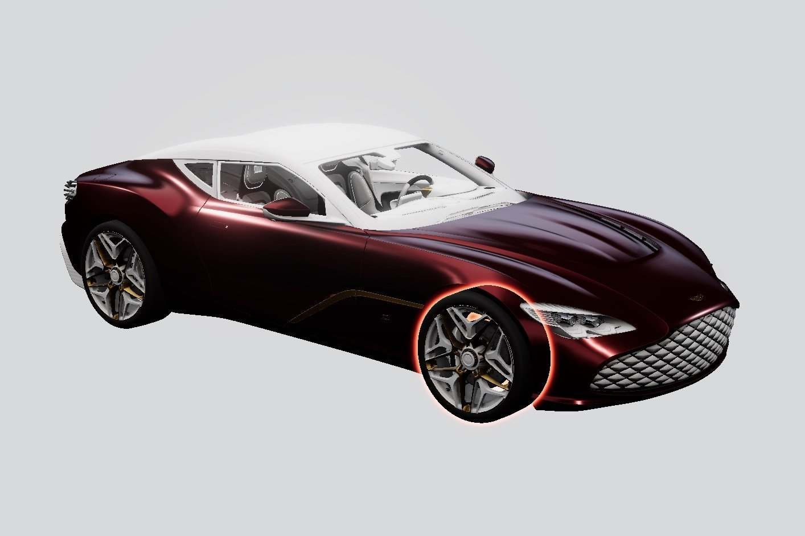
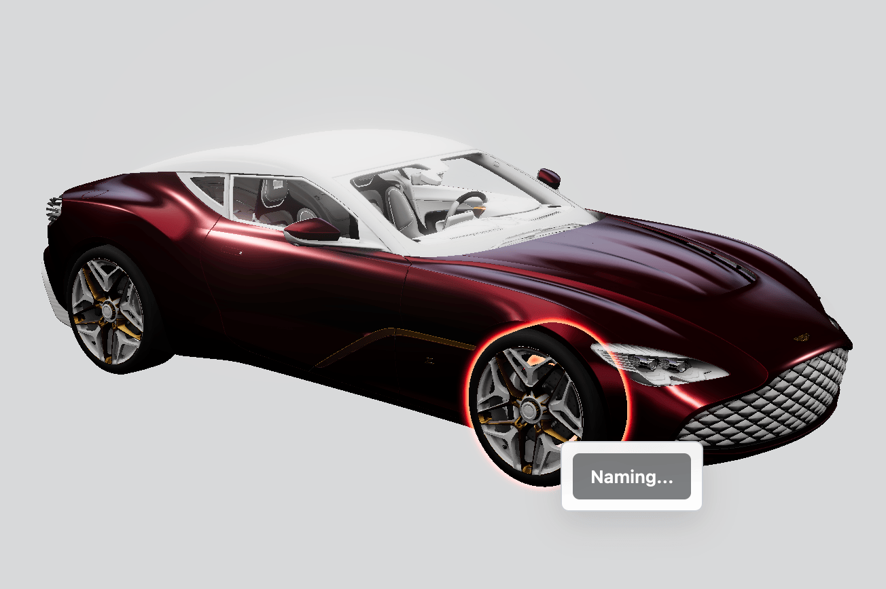
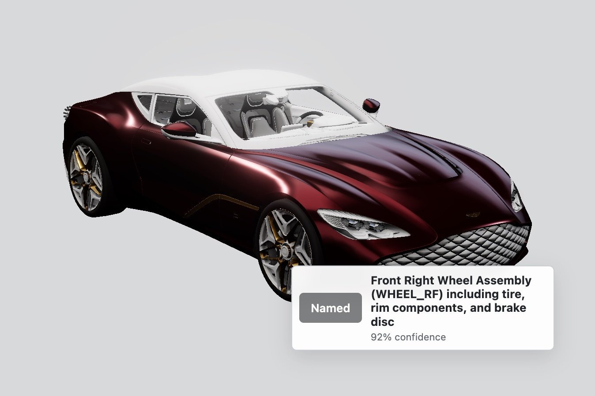

# CAD Nomenclature

CAD Nomenclature is an interactive 3D vehicle viewer that uses AI to identify selected CAD parts. It extracts geometry, material, position, and assembly data from the selected model part, sends that structured data to the part-identification agent, and displays the returned name and confidence score.

## Identifying a part

Click a component in the 3D model. The selected part is highlighted with a red outline.



The app extracts the selected part's CAD data (from a glb loader) and sends it to the AI agent for analysis.



The identified part name and confidence score appear beside the selected component.



## AI response

```json
{
  "identifiedPart": "Front Right Wheel Assembly (WHEEL_RF) including tire, rim components, and brake disc",
  "confidence": 0.92,
  "category": "Wheel and Tire Assembly",
  "system": "Wheels and Brakes",
  "location": {
    "vehicleRegion": "Front",
    "detailedPosition": "Front right wheel area (Front axle) – wheel well / suspension region"
  },
  "appearance": {
    "summary": "Multi-material wheel assembly with decorative gold rim segment, white metal rim, chrome accent ring, black rubber tire, and visible brake disc; decals on rim surface.",
    "shape": "Circular wheel with multiple rim components assembled together; tire mounted around rim; brake disc behind rotor visible through wheel",
    "sizeEstimate": "Bounding box roughly 0.46 m (width) × 0.58 m (height) × 0.62 m (depth); overall wheel diameter ≈ 0.62 m; rim width ≈ 0.46 m",
    "distinguishingFeatures": [
      "rim_gold_rf_rim_gold_0 with gold color and high metalness",
      "rim_metal_rf_rim_metal_0 providing primary structural rim",
      "rim_pp_chrome_rf_rim_chrome_0 chrome accent ring",
      "rim_decals_rf1_rim_decals_0 decals on rim surface (transparent) ",
      "GEO_Tyre_RF_EXT_WHEEL_0 black/grey tire exterior",
      "GEO_Disc_RF_EXT_BRAKEDISC_0 brake disc visible behind rim"
    ]
  },
  "function": {
    "summary": "Transmits torque to the road, supports vehicle weight, and provides braking interface.",
    "howItWorks": "Power from the axle hub is delivered to the wheel via the rim and tire; the tire provides traction and energy transfer to the road; the brake disc (rotor) provides a friction surface for brake calipers to slow/stop the wheel; decorative rim elements contribute to aesthetics without affecting core function",
    "importance": "Critical for propulsion, steering stability, braking performance, and overall safety; tire wear, rotor wear, and rim finish health directly affect handling and stopping distance"
  },
  "interactions": [
    {
      "component": "GEO_Tyre_RF_EXT_WHEEL_0",
      "relationship": "Tire mounted onto rim; interfaces with wheel for traction and ride quality"
    },
    {
      "component": "rim_gold_RF_rim_gold_0",
      "relationship": "Decorative gold rim component forming part of wheel assembly outer surface"
    },
    {
      "component": "rim_metal_RF_rim_metal_0",
      "relationship": "Primary structural Rim component providing load path from axle to tire"
    },
    {
      "component": "rim_pp_chrome_RF_rim_chrome_0",
      "relationship": "Chrome accent ring attached to rim surface"
    },
    {
      "component": "rim_decals_RF1_rim_decals_0",
      "relationship": "Decal layer applied to rim surface for branding/graphics"
    },
    {
      "component": "GEO_Disc_RF_EXT_BRAKEDISC_0",
      "relationship": "Brake disc mounted to hub; interacts with caliper for braking"
    }
  ],
  "materials": [
    "aluminum alloy (rim components)",
    "chrome plating (rim chrome accent)",
    "rubber (tire)",
    "cast iron or steel (brake disc)",
    "decal film/clear coat (rim decals)"
  ],
  "commonFailures": [
    "tire tread wear, punctures, sidewall damage",
    "tire/wheel imbalance or improper mounting",
    "brake disc wear, scoring, warping, or heat-related cracking",
    "caliper sticking or pad transfer affecting braking efficiency",
    "chrome/gold finish wear or corrosion on decorative rim parts",
    " decals fading or peeling under UV/abrasive contact"
  ],
  "userDescription": "This part represents the Front Right Wheel Assembly (WHEEL_RF) for the 2020 Aston Martin DBS GT Zagato. It comprises multiple rim components (gold decorative rim, main white-metal rim, chrome accent ring), a black rubber tire, a visible brake disc, and rim decals. The assembly mounts to the front suspension hub, supports vehicle weight, provides traction, and offers braking capability via the brake disc. Visual finishes include gold and chrome accents, with a black tire and white-metal rim, characteristic of a high-end performance wheel."
}
```

## Run locally

```bash
npm install
npm run dev
```

Open [http://localhost:5173](http://localhost:5173).

Build for production with `npm run build`.
